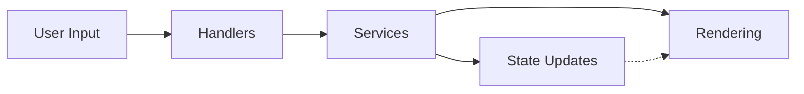

# TubeFlow - Developer Documentation
TubeFlow is a web-based tube map designer built with TypeScript and PIXI.js, focused on creating interactive transportation network diagrams.

## 🚀 Development Status
This project is in early development phase (pre-v1). Core drawing and interaction systems are not yet entirely functional.

## 🛠️ Tech Stack
TypeScript - For type safety and improved developer experience
PIXI.js - WebGL-based rendering engine for high-performance graphics
Parcel - For bundling and development server

## 🏗️ Architecture
TubeFlow uses a modular, service-oriented architecture designed for maintainability and separation of concerns:

### Application Layers
- **Rendering Layer** - PIXI.js containers and graphics objects that visualize the tube map
  - Handles WebGL rendering, viewport management, and graphical elements
- **Service Layer**  - Core business logic and state management
  - Maintains application state
  - Processes commands from handlers
  - Implements business rules
  - Manages relationships between entities
  - Coordinates rendering updates
- **Handler Layer** - Processes user input and delegates to services
  - Captures user interactions (clicks, drags, etc.)
  - Determines intent based on active tool
  - Translates raw input to meaningful operations
  - Invokes appropriate service methods
- **Infrastructure Layer** - Common utilities and support code
  - Grid system for alignment and snapping
  - Constants for configuration
  - Utility functions for geometry, math, and rendering
  - Type definitions and interfaces

 ### Data flow

